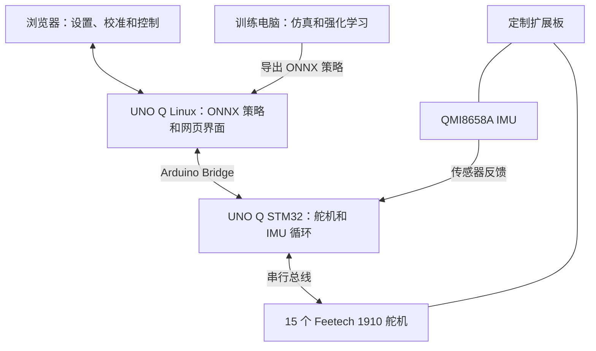

# XGO-Duck

[English](readme.md) · **简体中文**

**造一只机器鸭，探索它的运动方式，赋予它自己的动作。**

基于 Arduino UNO Q 和 15 个串行总线舵机的可 3D 打印双足机器人。

[装配指南](Assembly_Guide.pdf) · [物料清单](BOM.md) · [运行时](https://github.com/LuwuDynamics/xgoduck_runtime_arduino) · [训练](https://github.com/LuwuDynamics/xgoduck_rl)

*翻滚动作演示 · CyberBionic Maker*

## 认识 XGO-Duck

XGO-Duck 是 **陆吾智能（Luwu Dynamics）** 基于 Pollen Robotics 的 **Microduck** 适配的鸭形双足机器人。它由可打印结构、15 个 Feetech 1910 舵机、Arduino UNO Q，以及集成 IMU 和舵机接口的定制扩展板组成。

本仓库提供硬件制作的起点：**打印零件、准备电子器件、完成机器人装配**。配套仓库提供机载运行时和强化学习工具，将实体制作与运动实验连接起来。

| 制作 | 运行 | 实验 |
| --- | --- | --- |
| 打印机身、腿部、颈部、头部和柔性零件，按图解指南装配。 | 通过配套运行时的浏览器界面设置和校准机器人。 | 研究仿真、训练策略，探索自己的动作。 |
| [硬件文件](#硬件文件) | [机载运行时](https://github.com/LuwuDynamics/xgoduck_runtime_arduino) | [强化学习工具](https://github.com/LuwuDynamics/xgoduck_rl) |

## 近距离看一看

*XGO-Duck 原型：打印结构、关节式双腿，以及可活动的头部和嘴部。*

<table>
  <tr>
    <td align="center" width="62%"> <strong>可活动的头部和嘴部</strong> 4 个颈部／头部关节，以及独立的嘴部舵机。</td>
    <td align="center" width="38%"> <strong>便于检查的电子系统</strong> 后置控制器堆叠和可接近的走线。</td>
  </tr>
</table>

照片展示的是项目原型。制作时请使用与硬件版本匹配的装配指南和板卡文件。

## 硬件概览

| 子系统 | 配置 | 用途 |
| --- | --- | --- |
| 控制器 | Arduino UNO Q | Linux 主机负责策略推理和网页界面，STM32 MCU 负责舵机与传感器通信 |
| 执行器 | 15 个 Feetech 1910 串行总线舵机 | 10 个腿部关节、4 个颈部／头部关节、1 个嘴部关节 |
| 扩展板 | 陆吾 UNO Q 扩展板 | 配电、舵机连接和 IMU 集成 |
| 运动感知 | QMI8658A 六轴 IMU | 加速度和角速度反馈 |
| 结构 | STL 零件 | 机身、腿部、颈部和头部组件 |
| 柔性零件 | 文件名带 TPU 标识的 STL | 脚底和嘴部零件 |

运动策略输出 **14 个关节**的目标位置，嘴部舵机单独控制。器件细节和采购核对事项见 [BOM 说明](docs/BOM.md)。

### 系统连接方式

这是功能连接概览；电气接线请以板卡设计和装配文档为准。

## 开始制作

> **2026-10-02 硬件修订：** 旧版 ArduinoUnoQ PCB 的 **U3、U4、U5** 接口 GND 与 SIGNAL 接反。已生产旧板的用户请先断电，按[旧板处理说明](PCBA/README.md)核对并修正线束；2 脚电源不变。原理图和 PCB 已更新。

### 1. 准备零件和电子器件

在[物料清单](BOM.md)中查看整机采购条目、供应商链接和电池要求，在 [PCBA/](PCBA/) 中查看扩展板文件。整机 BOM 与 PCB 制造 BOM 用途不同：购买成品扩展板时，板上的器件已经包含在内。

| 零件 | 数量 |
| --- | ---: |
| Arduino UNO Q（2 GB / 4 GB） | 1 |
| [机器人扩展板（Luwu Dynamics Store）](https://shop.xgorobot.com/products/robot-driver-board?variant=67594424713467) | 1 |
| Feetech 1910 舵机 | 15 |
| AMP 3 针舵机线 | 15 |
| 电池组，原清单标注为“18650 battery 8.4V” | 1 |
| 8.4 V 锂离子电池充电器，5.5 × 2.1 mm DC 圆孔插头（DC5521） | 1 |
| M2 × 6 沉头螺钉 | 200 |
| M2.5 × 6 螺钉 | 6 |
| M3 × 16 螺钉 | 4 |
| 10 × 15 × 3 mm 轴承 | 2 |
| 16 × 22 × 4 mm 轴承 | 11 |

数量沿用采购清单，包括螺钉数量。采购或上电前，请根据[器件说明](docs/BOM.md)核对电池组、充电器、接头极性和供电要求。

### 2. 打印结构件

从 [structure/](structure/) 下载模型。文件名包含以下装配信息：

| 文件名特征 | 含义 | 示例 |
| --- | --- | --- |
| `2x_` | 打印两份 | `2x_shank.stl` |
| `left_` / `right_` | 左右侧分别提供文件 | `left_foot.stl`、`right_foot.stl` |
| `tpu` | 柔性零件 | `2x_foot_bottom_tpu.stl`、`mouth_up_tpu.stl` |

使用[打印零件清单](docs/PRINTING.md)核对零件。在打印全套零件前，先测试一个舵机安装位和轴承配合；完整、经过验证的打印参数仍待补充。

### 3. 设置舵机并装配

按照[运行时设置说明](https://github.com/LuwuDynamics/xgoduck_runtime_arduino#first-time-servo-setup)配置各舵机的 ID 和中心位置，再按照 [Assembly_Guide.pdf](Assembly_Guide.pdf) 进行装配。

| 装配参考 | 内容 |
| --- | --- |
| 第 1 页 | 舵机 ID 分布 |
| 第 2–5 页 | 输出轴准备、初始结构和走线 |
| 第 6–15 页 | 腿部、脚部和脚底 |
| 第 16–23 页 | 头部和颈部机构 |
| 第 24–25 页 | 最终装配 |

[制作指南](docs/BUILD_GUIDE.md)补充了准备与检查步骤。每次只配置一个舵机，标明 ID，并为各关节整个运动范围内的线缆活动留出空间。

### 4. 校准并开始运行

安装[机载运行时](https://github.com/LuwuDynamics/xgoduck_runtime_arduino)，检查舵机和 IMU 反馈，在支撑住机器人的状态下完成校准。先测试默认姿态，再进行运动试验。

运行时包含**行走、起身和抓取策略**，以及独立的嘴部控制。实际表现取决于装配、校准和测试条件。使用附带策略无需重新训练模型。

## 硬件文件

| 路径 | 内容 |
| --- | --- |
| [Assembly_Guide.pdf](Assembly_Guide.pdf) | 25 页图解装配参考 |
| [BOM.md](BOM.md) | 整机采购清单、供应商链接和电池接头参考图 |
| [structure/](structure/) | 可打印 STL 模型 |
| [PCBA/ArduinoUnoQ.SchDoc](PCBA/ArduinoUnoQ.SchDoc) | Altium 原理图源文件 |
| [PCBA/ArduinoUnoQ.PcbDoc](PCBA/ArduinoUnoQ.PcbDoc) | Altium PCB 源文件 |
| [PCBA/ArduinoUnoQ.pdf](PCBA/ArduinoUnoQ.pdf) | 板卡布局和尺寸图 |
| [PCBA/ArduinoUnoQ.DWG](PCBA/ArduinoUnoQ.DWG) · [STEP 模型](PCBA/ArduinoUnoQ.step) | 板卡外形和机械集成模型 |
| [PCBA/BOM.xlsx](PCBA/BOM.xlsx) · [贴片坐标](PCBA/Pick%20Place%20for%20ArduinoUnoQ.csv) | 扩展板装配物料和元件放置坐标 |
| [docs/](docs/) | 制作、打印、BOM 和故障排查说明 |

## 从硬件到自己的动作

| 仓库 | 用途 |
| --- | --- |
| **[xgoduck_hardware](https://github.com/LuwuDynamics/xgoduck_hardware)** | 机械零件、电子硬件、BOM 和装配 |
| **[xgoduck_runtime_arduino](https://github.com/LuwuDynamics/xgoduck_runtime_arduino)** | UNO Q 固件、策略执行、浏览器设置和控制 |
| **[xgoduck_rl](https://github.com/LuwuDynamics/xgoduck_rl)** | 仿真、强化学习训练和策略导出 |

在制作记录中同时记录硬件、运行时和策略的版本，便于复现可用配置和排查变化。

## 来源与贡献

XGO-Duck 基于 **Pollen Robotics** 的 [Microduck](https://github.com/pollen-robotics/microduck) 和 [microduck_rl](https://github.com/pollen-robotics/microduck_rl)。鸭形外观、15 舵机布局和策略关节顺序源于这些项目。陆吾智能的适配重点是 **Arduino UNO Q、Feetech 1910 舵机、定制扩展板，以及配套软件与模型集成**。详见[来源与适配说明](UPSTREAM.md)。

欢迎提交制作报告、经过测试的打印参数、更清晰的装配照片和可复现的修复。请阅读 [CONTRIBUTING.md](CONTRIBUTING.md)，或[提交 Issue](https://github.com/LuwuDynamics/xgoduck_hardware/issues)。

复用条款请参阅 [LICENSING.md](LICENSING.md) 和对应文件中的声明。联系邮箱：**hello@xgorobot.com**。
