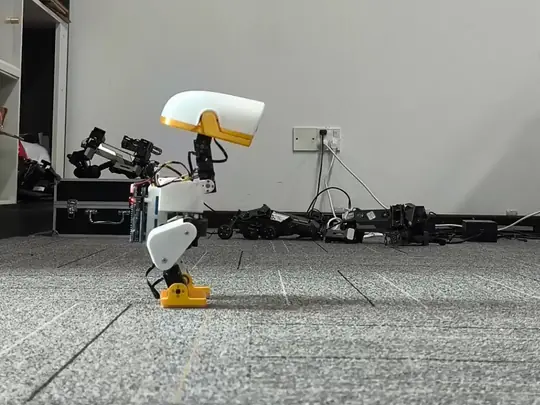
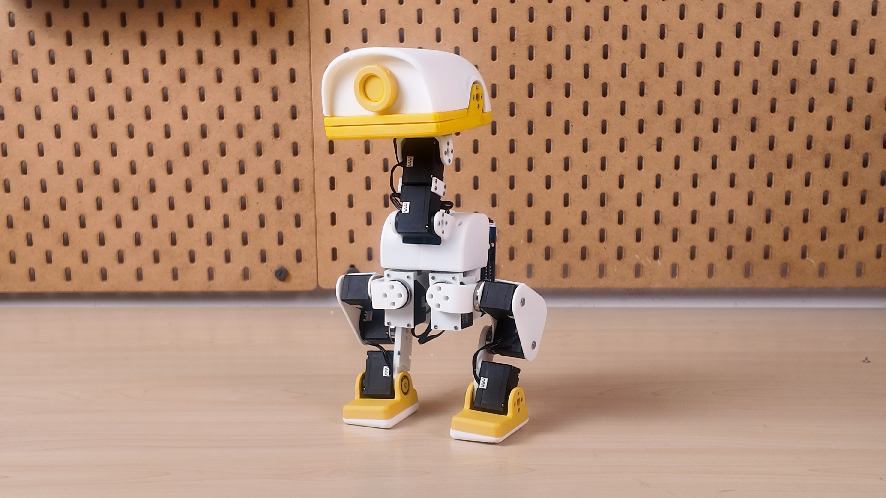
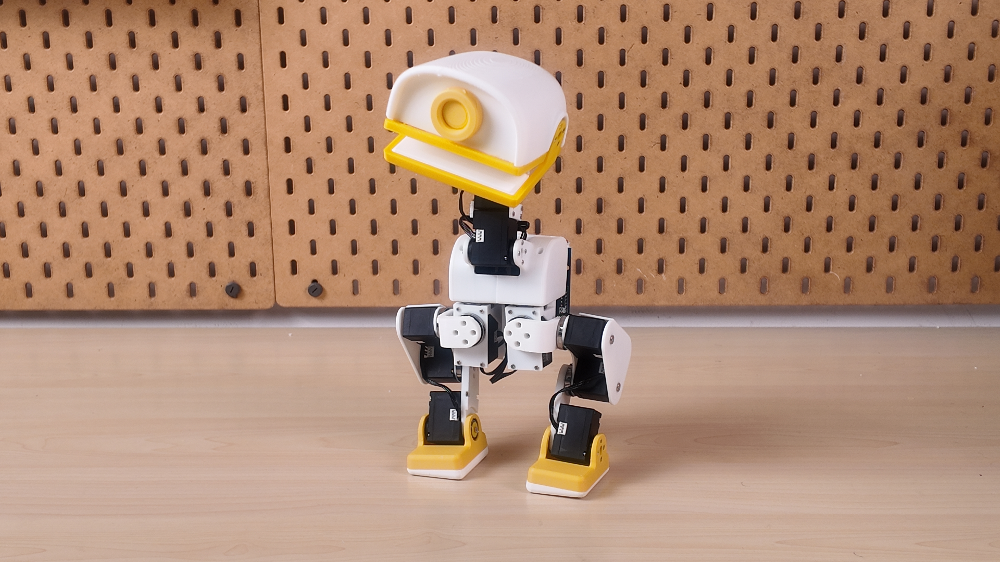
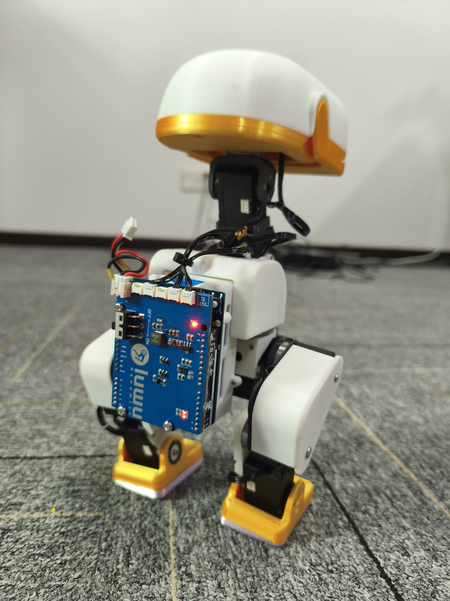
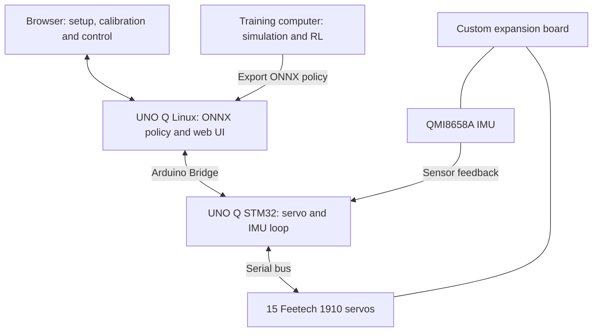
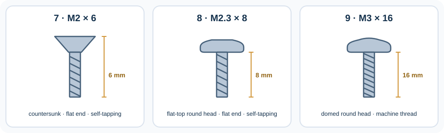

# XGO-Duck

**English** · [简体中文](README_CN.md)

**Build a robot duck. Explore how it moves. Make it your own.**

A 3D-printable biped robot built around Arduino UNO Q and 15 serial servos.

[Assembly guide](Assembly_Guide.pdf) · [Bill of materials](BOM.md) · [Runtime](https://github.com/LuwuDynamics/xgoduck_runtime_arduino) · [Training](https://github.com/LuwuDynamics/xgoduck_rl)

*A clean somersault · CyberBionic Maker*

## Meet XGO-Duck

XGO-Duck is a duck-shaped biped robot adapted by **Luwu Dynamics** from Pollen Robotics' **Microduck**. It combines a printable structure, fifteen Feetech 1910 servos, an Arduino UNO Q, and a custom expansion board with an IMU and servo interfaces.

This repository is the hardware starting point: **print the parts, prepare the electronics, and assemble the robot**. Companion repositories provide the onboard runtime and reinforcement-learning tools, connecting a physical build with motion experiments.

| Build | Run | Experiment |
| --- | --- | --- |
| Print the body, legs, neck, head and soft parts. Assemble with the illustrated guide. | Configure and calibrate the robot through the companion runtime's browser interface. | Study the simulation, train policies and explore your own motions. |
| [Hardware files](#hardware-files) | [Onboard runtime](https://github.com/LuwuDynamics/xgoduck_runtime_arduino) | [RL tools](https://github.com/LuwuDynamics/xgoduck_rl) |

## A closer look

*XGO-Duck prototype — printed parts, articulated legs, and a movable head and beak.*

<table>
  <tr>
    <td align="center" width="62%"> <strong>A movable head and beak</strong> Four neck/head joints and a separate mouth servo.</td>
    <td align="center" width="38%"> <strong>Electronics you can inspect</strong> Rear-mounted controller stack and accessible wiring.</td>
  </tr>
</table>

The photos show project prototypes. Follow the assembly guide and matching board files for your build revision.

## Hardware at a glance

| Subsystem | What it uses | Role |
| --- | --- | --- |
| Controller | Arduino UNO Q | Linux host for policy inference and web UI; STM32 MCU for servo and sensor communication |
| Actuation | 15 Feetech 1910 serial servos | 10 leg joints, 4 neck/head joints, and 1 mouth joint |
| Expansion board | Luwu UNO Q expansion board | Power distribution, servo connections and IMU integration |
| Motion sensing | QMI8658A 6-axis IMU | Acceleration and angular-velocity feedback |
| Structure | STL parts | Body, leg, neck and head components |
| Soft parts | TPU-designated STL files | Foot soles and mouth parts |

The motion policy outputs targets for **14 joints**; the mouth servo is controlled separately. Component details and purchasing checks are collected in the [BOM notes](docs/BOM.md).

### How the system connects

This is a functional overview; use the board design and assembly documentation for electrical connections.

## Start your build

> **Hardware correction — 2026-10-02:** The old ArduinoUnoQ PCB reverses GND and SIGNAL on **U3, U4 and U5**. Owners of previously manufactured boards should disconnect power and follow the [old-board wiring instructions](PCBA/README.md#english-notice-for-previously-manufactured-boards). Pin 2 power is unchanged. Schematic and PCB sources are updated.

### 1. Prepare parts and electronics

Open the [bill of materials](BOM.md) for the robot purchasing list, supplier links and battery requirements, and [PCBA/](PCBA/) for the expansion-board files. The robot BOM and PCB manufacturing BOM serve different purposes: a finished expansion board already includes its board-level components.

| Part | Quantity |
| --- | ---: |
| Arduino UNO Q (2 GB / 4 GB) | 1 |
| [Robot expansion board — Luwu Dynamics Store](https://shop.xgorobot.com/products/robot-driver-board?variant=67594424713467) | 1 |
| Feetech 1910 servo | 15 |
| AMP 3-pin servo cable | 15 |
| Battery pack, listed as “18650 battery 8.4V” | 1 |
| 8.4 V Li-ion battery charger with 5.5 × 2.1 mm DC barrel plug (DC5521) | 1 |
| M2 × 6 countersunk, flat-end self-tapping screw | 200 |
| M2.3 × 8 flat-top round-head, flat-end self-tapping screw | 6 |
| M3 × 16 round-head machine screw | 4 |
| 10 × 15 × 3 mm bearing | 2 |
| 16 × 22 × 4 mm bearing | 11 |

Quantities reproduce the purchasing list, including screw quantities. Confirm the pack, charger, connector polarity and power requirements using the [component notes](docs/BOM.md) before sourcing or powering the build.

**Identify the three fasteners before ordering.** Items 7 and 8 are self-tapping screws with flat ends. Items 8 and 9 share the same rounded side profile; item 8 has a flat top, while item 9 has the gently domed top shown in the photo below and a machine thread. The following shape guide is illustrative. See the [product photo and size references](BOM.md#fastener-identification) in the BOM.

*Item 9 has the domed top shown here. Item 8 has the same rounded sides but a flat top. The photo is a head-style reference, not a size or thread specification.*

### 2. Print the structure

Download the models from [structure/](structure/). The filenames carry useful assembly information:

| Filename pattern | Meaning | Example |
| --- | --- | --- |
| `2x_` | Print two copies | `2x_shank.stl` |
| `left_` / `right_` | Separate left and right parts | `left_foot.stl`, `right_foot.stl` |
| `tpu` | Flexible part | `2x_foot_bottom_tpu.stl`, `mouth_up_tpu.stl` |

Use the [print inventory](docs/PRINTING.md) to track parts. Test a servo mount and bearing fit before printing the full set; a complete validated print profile is still to be documented.

### 3. Configure servos and assemble

Prepare each servo's ID and center position using the [runtime setup instructions](https://github.com/LuwuDynamics/xgoduck_runtime_arduino#first-time-servo-setup), then follow [Assembly_Guide.pdf](Assembly_Guide.pdf).

| Assembly reference | Focus |
| --- | --- |
| Page 1 | Servo ID placement |
| Pages 2–5 | Shaft preparation, initial structure and cable routing |
| Pages 6–15 | Legs, feet and soles |
| Pages 16–23 | Head and neck mechanisms |
| Pages 24–25 | Final assembly |

The [build guide](docs/BUILD_GUIDE.md) adds preparation and inspection checkpoints. Configure one servo at a time, label its ID, and leave cable clearance through each joint's movement.

### 4. Calibrate and bring it to life

Install the [onboard runtime](https://github.com/LuwuDynamics/xgoduck_runtime_arduino), verify servo and IMU feedback, and complete calibration with the robot supported. Start with the default pose before motion trials.

The runtime includes **walk, get-up and pick policies**, plus separate mouth control. Their behavior depends on the assembled hardware, calibration and test conditions. Using the bundled policies does not require training a new model.

## Hardware files

| Path | Contents |
| --- | --- |
| [Assembly_Guide.pdf](Assembly_Guide.pdf) | 25-page illustrated assembly reference |
| [BOM.md](BOM.md) | Whole-robot purchasing list, supplier links and battery reference image |
| [structure/](structure/) | Printable STL models |
| [PCBA/ArduinoUnoQ.SchDoc](PCBA/ArduinoUnoQ.SchDoc) | Altium schematic source |
| [PCBA/ArduinoUnoQ.PcbDoc](PCBA/ArduinoUnoQ.PcbDoc) | Altium PCB source |
| [PCBA/ArduinoUnoQ.pdf](PCBA/ArduinoUnoQ.pdf) | Board layout and dimension drawing |
| [PCBA/ArduinoUnoQ.DWG](PCBA/ArduinoUnoQ.DWG) · [STEP model](PCBA/ArduinoUnoQ.step) | Board outline and mechanical integration model |
| [PCBA/BOM.xlsx](PCBA/BOM.xlsx) · [Pick-and-place data](PCBA/Pick%20Place%20for%20ArduinoUnoQ.csv) | Expansion-board assembly materials and placement coordinates |
| [docs/](docs/) | Build, printing, BOM and troubleshooting notes |

## From hardware to your own behavior

| Repository | Purpose |
| --- | --- |
| **[xgoduck_hardware](https://github.com/LuwuDynamics/xgoduck_hardware)** | Mechanical parts, electronics, BOM and assembly |
| **[xgoduck_runtime_arduino](https://github.com/LuwuDynamics/xgoduck_runtime_arduino)** | UNO Q firmware, policy execution, browser setup and control |
| **[xgoduck_rl](https://github.com/LuwuDynamics/xgoduck_rl)** | Simulation, reinforcement-learning training and policy export |

Keep the hardware, runtime and policy revisions together in your build record. This makes it easier to reproduce a working configuration and diagnose changes.

## Origins and contributions

XGO-Duck builds on [Microduck](https://github.com/pollen-robotics/microduck) and [microduck_rl](https://github.com/pollen-robotics/microduck_rl) by **Pollen Robotics**. The duck form, 15-servo arrangement and policy joint order originate in that work. Luwu Dynamics' adaptation focuses on **Arduino UNO Q, Feetech 1910 servos, the custom expansion board, and the matching software/model integration**. See [origins and adaptations](UPSTREAM.md).

Build reports, tested print settings, clearer assembly photos and reproducible fixes are welcome. Read [CONTRIBUTING.md](CONTRIBUTING.md) or [open an issue](https://github.com/LuwuDynamics/xgoduck_hardware/issues).

For reuse terms, consult [LICENSING.md](LICENSING.md) and the applicable file-level notices. Contact: **hello@xgorobot.com**.
